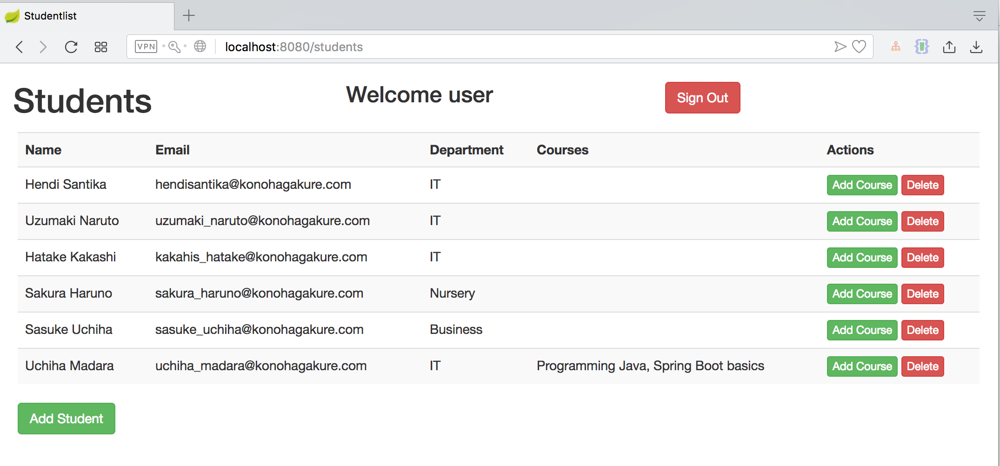

# StudentList
Simple CRUD application made with Spring Boot

- Spring Boot
- Thymeleaf
- H2 database
- Bootstrap

Usage (with eclipse):

1. Clone the project

2. Eclipse: File -> Import -> Maven -> Existing Maven Projects

3. Run 'mvn clean install'

4. Navigate to localhost:8080

Run this project by this command :

`mvn clean spring-boot:run`

Username & Password `user/user`

Login Page :

Add New Student

List Student Course

Add New Course

